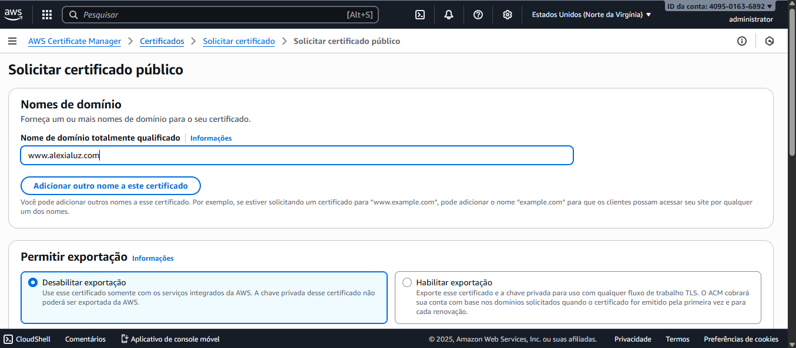
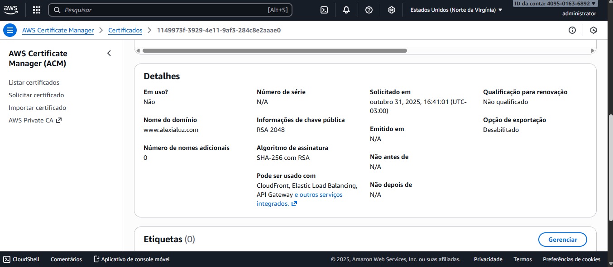
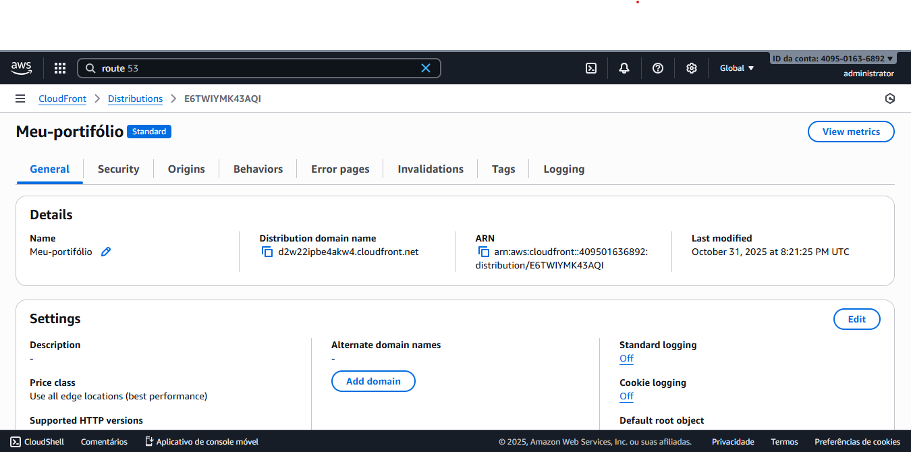
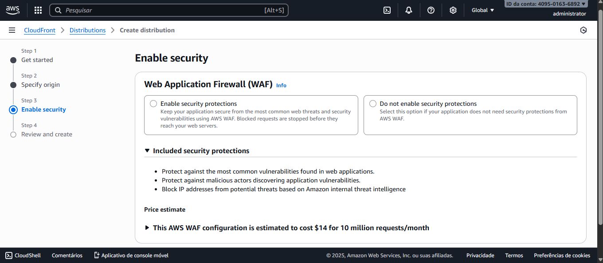

# desafio-aws-foundations-portifolio-alexia
Site estático hospedado no S3 e distribuído via CloudFront com HTTPS

##  Link de Acesso
- **S3:** http://desafio-aws-foundations-alexia.s3-website-us-east-1.amazonaws.com  
- **CloudFront (HTTPS):** https://d123abcd4567.cloudfront.net  (em andamento – aguardando validação do domínio)
- **Domínio personalizado:** https://www.alexialuz.com  (pendente de validação)

##  Serviços AWS utilizados
- Amazon S3 (Static Website Hosting)
- Amazon CloudFront (CDN)
- AWS Certificate Manager (SSL/TLS)
- (Opcional) Route 53 (DNS)

##  Evidências de Configuração

###  AWS Certificate Manager (ACM)
Criação do certificado público para o domínio `www.alexialuz.com`.

###  Certificado SSL/TLS emitido

###  Distribuição no Amazon CloudFront
Configuração da distribuição para entrega global do site.

###  Configuração de segurança (WAF)
Tela de configuração do WAF – neste caso **não habilitado**, por não ser necessário para site estático.

---

##  Aprendizados
Durante este desafio, foi possível:
- Compreender o funcionamento da hospedagem estática no S3  
- Configurar uma distribuição CloudFront e associar um certificado SSL  
- Entender a relação entre ACM, CloudFront e Route 53  
- Estruturar documentação e evidências no GitHub  

